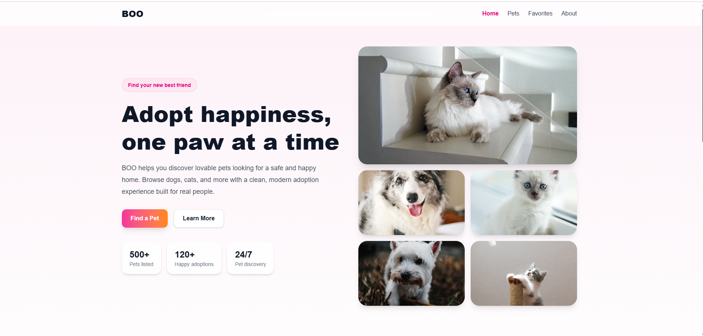
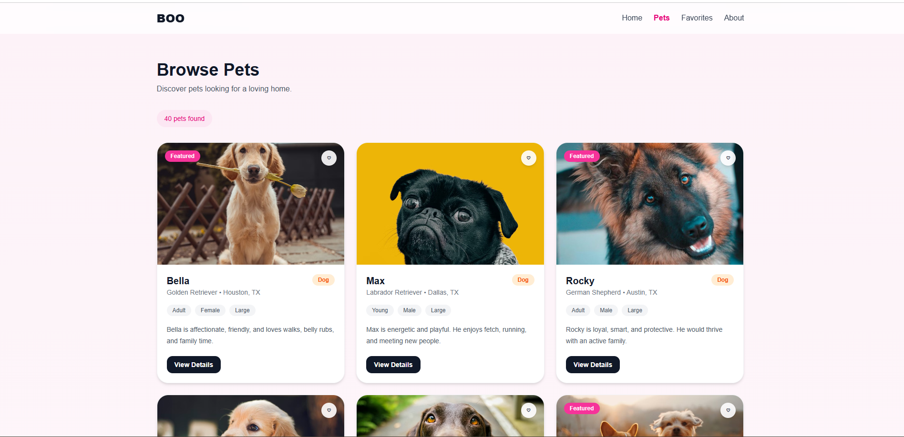

# BOO Pet Adoption App

BOO is a modern pet adoption web app built as a portfolio project. It helps users browse adoptable pets, explore detailed pet profiles, and save favorites through a clean, responsive, and user-friendly interface.

## Overview

The goal of this project is to create a realistic pet adoption experience with a polished frontend, strong component structure, and scalable state management. Since public pet adoption APIs are limited, the app currently uses a large mock dataset to simulate real-world browsing and filtering.

## Features

- Modern responsive landing page
- Browse pets in a clean card layout
- Filter pets by category
- Dynamic pet details page
- Save pets to favorites
- Favorites state managed with Redux Toolkit
- Persistent favorites using local storage
- Custom 404 page for undefined routes
- Built with reusable components and scalable folder structure

## Tech Stack

### Frontend
- React
- Vite
- Tailwind CSS
- React Router
- Redux Toolkit
- React Redux

### Data
- Large mock pet dataset

## Pages

### Home Page:
The landing page introduces the app with a hero section, pet imagery, and quick access to pet categories.

### Pets Page:
Displays the pet listing grid and supports browsing by category.

### Pet Details Page:
Shows detailed information for a selected pet, including breed, age, size, personality, and adoption-related details.

### Favorites Page:
Lets users save pets they are interested in and view them in one place.

### About Page:
Provides a short description of the project and its purpose.

### Not Found Page:
Handles invalid routes with a custom 404 experience.

### Favorites Feature:
The favorites feature is built with Redux Toolkit and persists data using local storage. This allows users to save pets and still see them after refreshing the page.

## Mock Data:
The app uses a large mock dataset that includes:

- Dogs and cats
- Different breeds
- Age groups
- Gender
- Size
- Location
- Featured pets
- Personality and compatibility details


## Installation

#### Clone the repository:
```bash
git clone https://github.com/Ruwaidah/boo-fe
```

#### Go into the project folder:
```bash
cd boo-fe
```

#### Install dependencies:
```bash
npm install
```

#### Run the development server:
```bash
npm run dev
```

## Screenshots

### Home Page


### Pets Page



## Live Demo
[Live Demo](https://boo-fe.onrender.com/)

## Author
Ruwaidah Alfakhri

